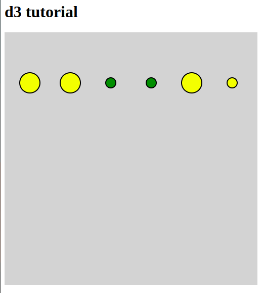

# D3_Visualization
## ✅ Tarea 01

1. Append a new SVG element to your HTML document with D3 (width: 500px, height: 500px).
2. Draw circles with D3: Append a new SVG circle for every object in the array.
3. Define dynamic properties.
4. Set the x/y coordinates and make sure that the circles don't overlap each other.

    4.1 Radius: large sandwiches should be twice as big as small ones.

    4.2 Colours: use two different circle colours. One colour (fill) for cheap products < 7.00 USD and one for more expensive products.
    
    4.3 Add a border to every circle (SVG property: stroke)

---

## 🧪 Resultado

